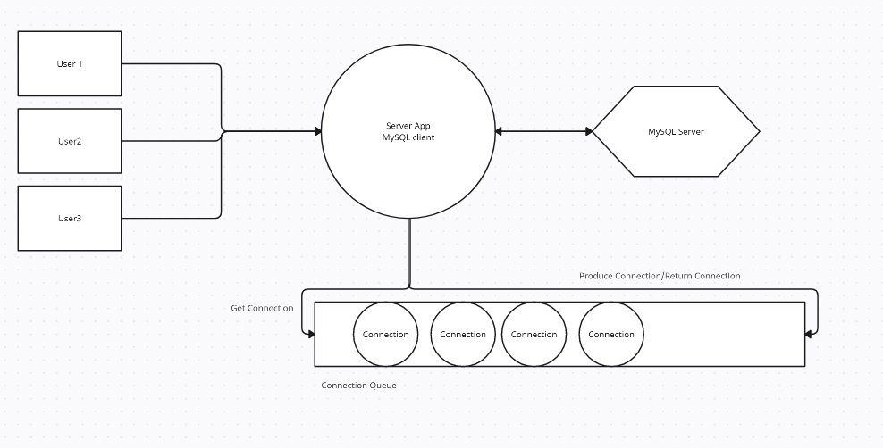
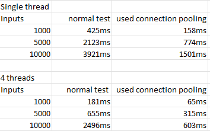

# Connection Pooling
<h2>Introduction<h2>
<h4>Connection pooling is a technique that is commonly used in web applications to improve the performance and scalability of database operations. When an application needs to access a database, it typically creates a new connection to the database server. However, creating and destroying database connections can be a time-consuming process, especially when the database server is located on a remote machine.

Connection pooling addresses this issue by maintaining a pool of database connections that can be reused by multiple clients. When a client requests a connection to the database, the connection pool checks if there is an available connection in the pool. If a connection is available, the pool returns the connection to the client, avoiding the overhead of creating a new connection. If no connections are available, the pool creates a new connection and adds it to the pool.

In the case of MySQL, connection pooling can be implemented using a variety of libraries, such as C3P0, DBCP, or HikariCP. These libraries typically provide a set of configuration options that allow developers to fine-tune the behavior of the connection pool, such as the maximum number of connections allowed in the pool, the minimum number of connections to keep in the pool, and the maximum amount of time a connection can be idle before it is removed from the pool.</h4>

<h2>How to improve?<h2>
<h4>In high concurrent moment, MySQL server needs to do massive TCP three-way handshake, MySQL Server connection certify, MySQL Server close connection taking back resources, and TCP four-way handshake, these costs are significantly high. 
We can design a connection queue, to store the connection, when a client disconnected with MySQL server, we do not return the resource and disconnect with MySQL, instead we push to the connection Queue, waiting for next client usage. By this, we can reduce the amount of above cost.<h4>

# Design 

# Platform
<h4>I developed this project on Windows11, vs2022, however, you can futher develope this project on linux, or you can complie the project on linux using g++, since all the functions implemented using  stl, and sql's c api, thus crossplatform supported.<h4>

# Stress testing

